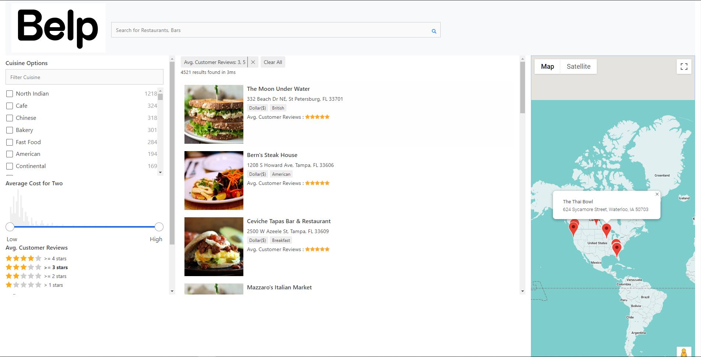

# Table Of Contents

- [Belp](#belp)
  - [Running the project](#running-the-project)
  - [Screenshots](#screenshots)
    - [Main View](#main-view)
  - [Techstack](#tech-stack)
  - [TODO](#todo)

# Belp

Belp is a front end restaurant rating app (just like Yelp) built with React. Users are able to browes between restaurants based on their budget, location, and cusine.

Demo: https://belp-yelp.herokuapp.com/

## Running the project

1. Clone the repo.
2. Run `npm install`.
3. Run `npm start`.
4. Navigate to `http://localhost:3000` (or other port based on the message in the console).

## Screenshots

### Main View
Main screen for user to select who they are.

## Techstack
- React
- Elastic search
- Google Maps API
- appbase custom API

## TODO